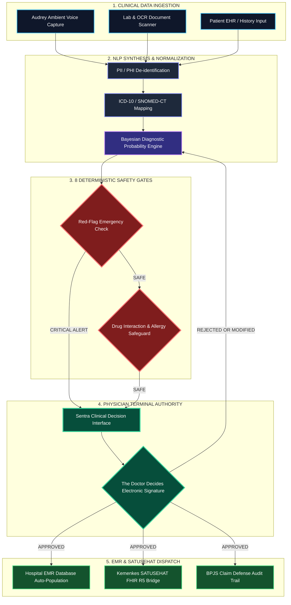

<p align="center">
  <a href="https://sentrahai.com">
    
  </a>
</p>

<p align="center">
  <a href="https://sentrahai.com">
    
  </a>
  
  
  
</p>

<p align="center">
  <sub><b>Sentra Synapse Corporate Venture Capital</b> · The Intersection of Clinical Excellence and Artificial Intelligence.</sub>
</p>

---

# SENTRA SYNAPSE // CORPORATE VENTURE CAPITAL

> *"The Intersection of Clinical Excellence and Artificial Intelligence."*
> — **Sentra Synapse Corporate Doctrine**

**PT Sentra Sinergi Saraf Ventura** is a medical technology and strategic investment company operating as a single-member Corporate Venture Capital (CVC), born directly from a validated ward-level clinical environment at **RSIA Melinda DHAI, Kediri**.

The company integrates two core future pillars: **Advanced Medical AI Engineering** and **HealthTech Venture Capital Acceleration**. Powered by its flagship platform at [sentrahai.com](https://sentrahai.com), the enterprise is dedicated to eliminating clinician cognitive friction, resolving fragmented patient medical records scattered across legacy silos, and accelerating life-saving point-of-care clinical decisions in seconds.

<br />

<p align="center">
  
  
  
  
</p>

---

## ── 00 · LEGAL ENTITY & CORPORATE GOVERNANCE

<table>
<tr>
<th align="left">Administrative Field</th>
<th align="left">Corporate Specification</th>
</tr>
<tr>
<td><b>Official Legal Entity Name (Deed)</b></td>
<td>PT Sentra Sinergi Saraf Ventura</td>
</tr>
<tr>
<td><b>Legal Structure & Entity Type</b></td>
<td>Single-Member Limited Liability Company (PT Perorangan - Micro MSME Scheme)</td>
</tr>
<tr>
<td><b>Commercial Branding</b></td>
<td>Sentra Synapse Corporate Venture Capital (Sentra Synapse CVC)</td>
</tr>
<tr>
<td><b>Official Tagline</b></td>
<td><i>“The Intersection of Clinical Excellence and Artificial Intelligence.”</i></td>
</tr>
<tr>
<td><b>Headquarters Address</b></td>
<td>Technology Laboratory Area, RSIA Melinda DHAI, Kediri, East Java, Indonesia</td>
</tr>
<tr>
<td><b>Official Electronic Mail</b></td>
<td><a href="mailto:drferdiiskandar@sentrahai.com">drferdiiskandar@sentrahai.com</a></td>
</tr>
<tr>
<td><b>Digital Domain (URL)</b></td>
<td><a href="https://sentrahai.com">https://sentrahai.com</a></td>
</tr>
</table>

---

## ── 01 · CORE DIRECTIVE & NATIONAL HEALTH TRANSFORM

> *"The doctor decides. Sentra clarifies."*
> — **Sentra Clinical Acceleration Doctrine**

Sentra AI addresses a critical challenge across healthcare facilities in Indonesia: frontline physicians must deliver high-stakes diagnostic decisions under time pressure, heavy cognitive load, and fragmented patient records scattered across legacy systems.

Founded upon the strategic clinical vision of **Dr. Ferdi Iskandar** (Active Hospital CEO for 10+ years, practicing physician with 15+ years of clinical experience, and medical law specialist), Sentra AI deploys 23 interconnected technological modules that structure patient data and eliminate point-of-care cognitive friction in support of **Program Indonesia Sehat** and the **6 Pillars of Health System Transformation by the Ministry of Health RI**.

```text
┌────────────────────────────────────────────────────────────────────────┐
│                     THREE CORE SENTRA PRINCIPLES                       │
│  1. Human Terminal Authority : Doctors hold ethical & clinical control.│
│  2. AI Clarifies             : Synthesizes data, flags red flags & ICD.│
│  3. Hard Safety Guardrails   : 8 Deterministic Safety Gates (No Bypass)│
└────────────────────────────────────────────────────────────────────────┘
```

---

## ── 02 · REAL-TIME CLINICAL METRICS & DATA SCALE

Validated directly within live clinical care environments at **RSIA Melinda DHAI Kediri**, Sentra AI has structured and processed thousands of verified clinical data points:

<table>
<tr>
<td width="25%" align="center" valign="top">

### 45,030+
**Medical Records**
<br />
<sub>Structured clinical records analyzed across clinical reasoning validation benchmarks.</sub>

</td>
<td width="25%" align="center" valign="top">

### 159
**Disease Entities**
<br />
<sub>Differential diagnostic algorithms calibrated for priority conditions in Indonesia.</sub>

</td>
<td width="25%" align="center" valign="top">

### 1,930
**ICD-10/11 Mappings**
<br />
<sub>Automatic translation from clinical narratives into standard diagnostic ICD codes.</sub>

</td>
<td width="25%" align="center" valign="top">

### 8
**Safety Gates**
<br />
<sub>Deterministic safety filters forbidding ungated AI output without physician sign-off.</sub>

</td>
</tr>
</table>

---

## ── 03 · COMPLETE SYSTEM CONSTELLATION (23 ENTERPRISE PROJECTS)

<sub>All 23 ecosystem project modules within Sentra AI operate under a unified monorepo architecture while remaining fully modular (*separable by design*).</sub>

<br />

<p align="center">
  
</p>

<table>
<tr>
<td width="50%" valign="top">

<b>01 · AADI</b> &nbsp;
<br />
<sub><b>Autonomous Artificial Diagnostic Intelligence</b></sub>
<br />
<sub>Layered diagnostic reasoning engine featuring Bayesian probability calculations, automatic ICD-11 mapping, and strict clinician boundary checks.</sub>
<br />
<sub><code>FUNGSI: Decision support overlay. Never final diagnosis.</code></sub>
<br /><br />

</td>
<td width="50%" valign="top">

<b>02 · AUDREY</b> &nbsp;
<br />
<sub><b>Voice-First Ambient Clinical Intelligence</b></sub>
<br />
<sub>Ambient voice assistant for consultation rooms. Captures clinical dialogues, flags critical emergencies, and routes specialist consultations.</sub>
<br />
<sub><code>FUNGSI: Ambient voice transcription & emergency triaging.</code></sub>
<br /><br />

</td>
</tr>
<tr>
<td width="50%" valign="top">

<b>03 · INTELLIGENCE DASHBOARD</b> &nbsp;
<br />
<sub><b>Unified Command Surface for Hospital Operations</b></sub>
<br />
<sub>Centralized operational command interface for inpatient monitoring, EMR integration, telemedicine modules, and clinical performance analytics.</sub>
<br />
<sub><code>FUNGSI: Single pane of glass for hospital operations.</code></sub>
<br /><br />

</td>
<td width="50%" valign="top">

<b>04 · ASISTE MEDIS (SENTRA ASSIST)</b> &nbsp;
<br />
<sub><b>Clinical Workflow Browser Extension</b></sub>
<br />
<sub>Smart browser extension embedded directly inside legacy EMRs. Eliminates repetitive typing and surfaces structured decision-support overlays.</sub>
<br />
<sub><code>FUNGSI: Frictionless EMR auto-fill & decision overlay.</code></sub>
<br /><br />

</td>
</tr>
<tr>
<td width="50%" valign="top">

<b>05 · TELEMEDICINE ENGINE</b> &nbsp;
<br />
<sub><b>Clinical-Grade Remote Consultation Protocol</b></sub>
<br />
<sub>High-speed WebRTC remote consultation infrastructure with direct clinical note integration, digital queueing, and care continuity guarantees.</sub>
<br />
<sub><code>FUNGSI: Clinical-grade remote consultation service.</code></sub>
<br /><br />

</td>
<td width="50%" valign="top">

<b>06 · REFERRALINK</b> &nbsp;
<br />
<sub><b>Referral & Claim-Awareness Routing Engine</b></sub>
<br />
<sub>Inter-facility referral routing protocol engineered around BPJS regulatory compliance, semantic cache optimization, and claim defense validation.</sub>
<br />
<sub><code>FUNGSI: Precise and efficient referral navigation.</code></sub>
<br /><br />

</td>
</tr>
<tr>
<td width="50%" valign="top">

<b>07 · MED-COGNITIVE</b> &nbsp;
<br />
<sub><b>Persistent Multi-Agent Memory Infrastructure</b></sub>
<br />
<sub>Distributed agent memory architecture featuring vector-based semantic retrieval, long-term patient context retention, and trajectory tracking.</sub>
<br />
<sub><code>FUNGSI: Long-term agent memory with zero hidden assumptions.</code></sub>
<br /><br />

</td>
<td width="50%" valign="top">

<b>08 · MELLY</b> &nbsp;
<br />
<sub><b>Maternal & Pediatric Personal Companion Agent</b></sub>
<br />
<sub>Personal virtual agent accompanying patients across preconception, pregnancy, postpartum care, and pediatric growth tracking.</sub>
<br />
<sub><code>FUNGSI: Continuous maternal-child healthcare guidance.</code></sub>
<br /><br />

</td>
</tr>
<tr>
<td width="50%" valign="top">

<b>09 · MELINDA DASHBOARD</b> &nbsp;
<br />
<sub><b>Hospital Interoperability Data Hub</b></sub>
<br />
<sub>Cross-departmental data interoperability hub for RSIA Melinda, unifying fragmented laboratory, pharmacy, inpatient, and administrative silos.</sub>
<br />
<sub><code>FUNGSI: Centralized hospital data integration.</code></sub>
<br /><br />

</td>
<td width="50%" valign="top">

<b>10 · MELINDA SHIELD</b> &nbsp;
<br />
<sub><b>Predictive Cybersecurity & PHI Governance</b></sub>
<br />
<sub>Multi-layered clinical data security architecture featuring real-time threat analysis, zero-trust tokenization, and strict PII/PHI isolation.</sub>
<br />
<sub><code>FUNGSI: Hardening clinical AI environments perimeter.</code></sub>
<br /><br />

</td>
</tr>
<tr>
<td width="50%" valign="top">

<b>11 · AUTONOMOUS ADMISSION</b> &nbsp;
<br />
<sub><b>Smart Patient Flow & Registration Engine</b></sub>
<br />
<sub>Automated referral intake processing, identity document extraction, eligibility validation, and outpatient waiting room queue optimization.</sub>
<br />
<sub><code>FUNGSI: Admission flow without waiting-room entropy.</code></sub>
<br /><br />

</td>
<td width="50%" valign="top">

<b>12 · SMART TRIAGE</b> &nbsp;
<br />
<sub><b>Early Risk Detection & Prioritization Engine</b></sub>
<br />
<sub>Pre-encounter symptom extraction and emergency severity scoring designed to brief attending clinicians before face-to-face contact.</sub>
<br />
<sub><code>FUNGSI: Detecting emergency risk before arrival.</code></sub>
<br /><br />

</td>
</tr>
<tr>
<td width="50%" valign="top">

<b>13 · PROACTIVE CARE NAVIGATOR</b> &nbsp;
<br />
<sub><b>Post-Discharge Continuity Framework</b></sub>
<br />
<sub>Post-discharge monitoring engine managing treatment adherence, automated follow-up scheduling, and immunization reminders.</sub>
<br />
<sub><code>FUNGSI: Ensuring no patient vanishes after discharge.</code></sub>
<br /><br />

</td>
<td width="50%" valign="top">

<b>14 · AMBIENT SCRIBE</b> &nbsp;
<br />
<sub><b>Voice-to-EMR Medical Transcription Engine</b></sub>
<br />
<sub>Transforms verbal consultation dialogues into structured medical notes mapped directly into corresponding EMR variables.</sub>
<br />
<sub><code>FUNGSI: Doctors focus on patients, not cursors.</code></sub>
<br /><br />

</td>
</tr>
<tr>
<td width="50%" valign="top">

<b>15 · CRITICAL ALERT SYSTEM</b> &nbsp;
<br />
<sub><b>Real-Time Deterioration & Escalation Alert</b></sub>
<br />
<sub>Continuous monitoring of vital signs and critical laboratory thresholds with direct instant escalation lines to attending medical teams.</sub>
<br />
<sub><code>FUNGSI: Physiological deterioration never goes unnoticed.</code></sub>
<br /><br />

</td>
<td width="50%" valign="top">

<b>16 · PREDICTIVE BED MANAGEMENT</b> &nbsp;
<br />
<sub><b>Orchestrator Bed Turnover & Discharge Readiness</b></sub>
<br />
<sub>Orchestration layer coordinating discharge readiness, bed turnover, housekeeping tasks, pharmacy clearance, and bed availability.</sub>
<br />
<sub><code>FUNGSI: Beds move at hospital speed, not paperwork speed.</code></sub>
<br /><br />

</td>
</tr>
<tr>
<td width="50%" valign="top">

<b>17 · AI CODING AUDITOR</b> &nbsp;
<br />
<sub><b>Clinical Coding & Claim Defense Suite</b></sub>
<br />
<sub>Automated consistency auditing matching clinical documentation against ICD-10/ICD-9-CM codes to eliminate BPJS claim disputes.</sub>
<br />
<sub><code>FUNGSI: Reducing claim dispute risks at the source.</code></sub>
<br /><br />

</td>
<td width="50%" valign="top">

<b>18 · OR ORCHESTRATOR</b> &nbsp;
<br />
<sub><b>Operating Room Logistics & Readiness Suite</b></sub>
<br />
<sub>Real-time logistics coordination managing surgical schedule prioritization, surgical team readiness, blood product logistics, and room sterilization.</sub>
<br />
<sub><code>FUNGSI: Operating room logistics intelligence.</code></sub>
<br /><br />

</td>
</tr>
<tr>
<td width="50%" valign="top">

<b>19 · POGS</b> &nbsp;
<br />
<sub><b>Pregnancy Observation & Guidance System</b></sub>
<br />
<sub>High-risk maternal-fetal surveillance system tracking gestational age trajectories, preeclampsia indicators, and structured antenatal guidance.</sub>
<br />
<sub><code>FUNGSI: Dual-life surveillance and protection.</code></sub>
<br /><br />

</td>
<td width="50%" valign="top">

<b>20 · CDOS</b> &nbsp;
<br />
<sub><b>Clinical Decision Orchestration System</b></sub>
<br />
<sub>Translates Clinical Practice Guidelines (PPK) into interactive digital diagnostic workflows while preserving end-to-end physician oversight.</sub>
<br />
<sub><code>FUNGSI: Guidelines that execute rather than gather dust.</code></sub>
<br /><br />

</td>
</tr>
<tr>
<td width="50%" valign="top">

<b>21 · TRIAGE ALGORITHMIC ENGINE</b> &nbsp;
<br />
<sub><b>Emergency Severity Indexing Engine</b></sub>
<br />
<sub>Automated Emergency Severity Index (ESI) calculator stratifying patient risk based on vital parameters and chief complaints upon ER entry.</sub>
<br />
<sub><code>FUNGSI: Emergency prioritization driven by risk.</code></sub>
<br /><br />

</td>
<td width="50%" valign="top">

<b>22 · CLINICAL FORECAST ENGINE</b> &nbsp;
<br />
<sub><b>Readmission & Trajectory Forecasting Engine</b></sub>
<br />
<sub>Predictive modeling engine estimating 30-day readmission probabilities and forecasting inpatient complication trajectories.</sub>
<br />
<sub><code>FUNGSI: Care shifting from reactive to anticipatory.</code></sub>
<br /><br />

</td>
</tr>
<tr>
<td width="100%" colspan="2" valign="top">

<b>23 · SENTRAPEDIA & SENTRAWIKI</b> &nbsp;
<br />
<sub><b>Evidence-Based Knowledge Engine & Protocol Repository</b></sub>
<br />
<sub>Integrated medical encyclopedia and evidence-based medicine protocol repository connected directly to Sentra's clinical RAG search engine.</sub>
<br />
<sub><code>FUNGSI: Standardized clinical evidence reference for healthcare practitioners.</code></sub>
<br /><br />

</td>
</tr>
</table>

---

## ── 03.5 · EDITORIAL PRODUCT SHOWCASE & INTERFACE GALLERY

> *"Synthesizing complex ward realities into serene, high-precision digital surfaces."*
> — **Sentra Product & Design Architecture**

<table width="100%">
<tr>
<td width="100%" colspan="2" align="center" valign="top">

<a href="https://i.ibb.co/0p40Qjxb/medlink.png">
  
</a>
<br /><br />
<b>EDITORIAL SPOTLIGHT 01 // MEDLINK INTEROPERABILITY MESH</b>
<br />
<sub>Hospital-wide data integration surface bridging legacy EMRs with Kemenkes SATUSEHAT FHIR R5 schemas and automated BPJS claim defense validation.</sub>
<br /><br />

</td>
</tr>
<tr>
<td width="50%" align="center" valign="top">

<a href="https://i.ibb.co/zh8fCkYS/mantra.png">
  
</a>
<br /><br />
<b>SPOTLIGHT 02 // MANTRA COMMAND CONSOLE</b>
<br />
<sub>Real-time clinical telemetry monitoring, early deterioration scoring, and multi-agent clinical decision orchestration surface.</sub>
<br /><br />

</td>
<td width="50%" align="center" valign="top">

<a href="https://i.ibb.co/dRFkwWp/bimbel2.png">
  
</a>
<br /><br />
<b>SPOTLIGHT 03 // ACADEMIC & CLINICAL SIMULATOR</b>
<br />
<sub>Interactive EBM knowledge engine, differential reasoning training, and clinical protocol simulation suite for ward physicians.</sub>
<br /><br />

</td>
</tr>
</table>

---

## ── 04 · THE 7 CLINICAL PROTOCOLS & ENGINES

Sentra AI operates **7 Core Clinical Protocol Engines** designed to synthesize complex medical data into clear diagnostic insights:

<table>
<tr>
<td width="50%" valign="top">

### 01 · CLINICAL NLP SYNTHESIS ENGINE
Parses unstructured consultation speech and clinical notes into standardized SOAP (*Subjective, Objective, Assessment, Plan*) summaries.

</td>
<td width="50%" valign="top">

### 02 · BAYESIAN DIAGNOSTIC PROBABILITY
Calculates differential diagnostic probabilities using Bayesian inference, weighing cumulative symptoms against disease incidence baselines.

</td>
</tr>
<tr>
<td width="50%" valign="top">

### 03 · TRAJECTORY & PROGNOSIS INTELLIGENCE
Predictive modeling mapping disease progression trajectories to intercept physiological deterioration and complications early.

</td>
<td width="50%" valign="top">

### 04 · OCR MEDICAL DOCUMENT INGESTION
Automated data extraction from printed laboratory reports, radiology findings, and historical medical records into structured variables.

</td>
</tr>
<tr>
<td width="50%" valign="top">

### 05 · PHARMACEUTICAL SAFEGUARD
Automated verification of drug dosages, drug-drug interaction risks, and patient allergy contraindications prior to prescription sign-off.

</td>
<td width="50%" valign="top">

### 06 · REFERRAL AUTOMATION & INTEROPERABILITY
Generates standardized medical referral records compliant with **SATUSEHAT FHIR R5** and validates BPJS claim defense documentation.

</td>
</tr>
<tr>
<td width="100%" colspan="2" valign="top">

### 07 · PROGNOSTIC MODELING & PATIENT RISK SCORING
Calculates patient risk scores to assist emergency severity indexing and clinical care prioritization across ER and outpatient wards.

</td>
</tr>
</table>

---

## ── 05 · END-TO-END DATA FLOW & SAFETY PIPELINE

### End-to-End Clinical Data Pipeline (Mermaid Diagram)



### Signal Path Architecture

```text
  [PATIENT ENCOUNTER DATA] ── (Voice / OCR / EMR)
             │
             ▼
  ┌─────────────────────────────────┐
  │ NLP Synthesis & Normalization   │ ─── (De-identification & ICD-10 Mapping)
  └─────────────────────────────────┘
             │
             ▼
  ┌─────────────────────────────────┐
  │ Bayesian Probability Engine     │ ─── (Calculates Differential Probabilities)
  └─────────────────────────────────┘
             │
             ▼
  ┌─────────────────────────────────┐
  │ 8 DETERMINISTIC SAFETY GATES    │ ─── [Red-Flag & Drug Interaction Guardrails]
  └─────────────────────────────────┘
             │
             ▼
  ┌─────────────────────────────────┐
  │ PHYSICIAN WORKBENCH INTERFACE   │ ◄─── "The doctor decides. Sentra clarifies."
  └─────────────────────────────────┘
             │
             ▼
  ┌─────────────────────────────────┐
  │ SATUSEHAT FHIR R5 & EMR DISPATCH│ ─── (Immutable Audit Log Persisted)
  └─────────────────────────────────┘
```

---

## ── 06 · ENGINEERING STACK & INSTRUMENTATION

<table>
<tr>
<td width="33%" valign="top">

### CLINICAL NLP & BAYESIAN
- Python 3.12, PyTorch, vLLM
- Medical LLM Fine-Tuning (Llama-3 Clinical / Med-PaLM)
- Deepgram / Whisper-Large-v3 Speech Engine
- Bayesian Probabilistic Graph Libraries

</td>
<td width="33%" valign="top">

### DATA & RETRIEVAL MESH
- Qdrant Vector Database
- Redis Enterprise Semantic Cache
- PostgreSQL 16 (Partitioned Clinical Logs)
- HAPI FHIR R5 Integration Gateway

</td>
<td width="33%" valign="top">

### INFRASTRUCTURE & SECURITY
- Hybrid Kubernetes (On-Prem / Cloud)
- HashiCorp Vault & Zero-Trust PHI Encryption
- TypeScript 5.5, Next.js 15, Tailwind v4
- OpenAPI 3.1 Auditable Service Contracts

</td>
</tr>
</table>

<p align="center">
  
</p>

---

## ── 07 · CLINICAL GOVERNANCE & 8 SAFETY GATES

```text
No output without auditability.
No diagnosis without physician review.
No prescription without drug-interaction verification.
No patient data transmission without Zero-Trust encryption.
```

The **8 Deterministic Safety Gates** enforced across the Sentra AI clinical execution pipeline:

<table>
<tr>
<th align="left">Safety Gate</th>
<th align="left">Protection Mechanism</th>
</tr>
<tr>
<td><b>1. Red-Flag Emergency Alert</b></td>
<td>Instant alert trigger upon detection of life-threatening symptoms (e.g., Acute Coronary Syndrome, Anaphylactic Shock).</td>
</tr>
<tr>
<td><b>2. Contraindication Checker</b></td>
<td>Prevents therapeutic recommendations contradicting recorded patient comorbid conditions.</td>
</tr>
<tr>
<td><b>3. Drug-Drug Interaction Filter</b></td>
<td>Automated validation checking adverse reaction risks across multi-drug prescriptions.</td>
</tr>
<tr>
<td><b>4. Pediatric & Maternal Dosage Boundary</b></td>
<td>Recalculates safe dosage boundaries based on patient weight and gestational age.</td>
</tr>
<tr>
<td><b>5. Patient Allergy Verification</b></td>
<td>Blocks prescriptions of drugs recorded in historical patient allergy records.</td>
</tr>
<tr>
<td><b>6. Diagnostic Confidence Threshold</b></td>
<td>Communicates diagnostic uncertainty whenever medical data confidence falls below safety thresholds.</td>
</tr>
<tr>
<td><b>7. Zero-Trust PHI De-identification</b></td>
<td>Strips personal identifying information (Name, National ID, Address) before AI processing.</td>
</tr>
<tr>
<td><b>8. Physician Terminal Sign-Off</b></td>
<td>Enforces electronic signature sign-off before any record is committed to the EMR.</td>
</tr>
</table>

---

## ── 08 · RESEARCH LAB & INSTITUTIONAL PARTNERS

Sentra AI undergoes continuous development and clinical validation within live hospital environments:

<table width="100%">
<tr>
<td width="50%" align="center" valign="top">
  
  <br /><br />
  <b>Melinda Advanced Technology Laboratory</b>
  <br />
  <sub>
    Clinical validation laboratory at RSIA Melinda DHAI Kediri, East Java, Indonesia. Primary testing ground for CDSS performance, Audrey AI, and ward EMR integration.
  </sub>
</td>
<td width="50%" align="center" valign="top">
  
  <br /><br />
  <b>MedLab Innovations</b>
  <br />
  <sub>
    Medical ecosystem research partner supporting laboratory automation, OCR data extraction, and diagnostic variable standardization.
  </sub>
</td>
</tr>
</table>

---

## ── 09 · LEADERSHIP & CLINICAL STEWARDSHIP

<table>
<tr>
<td width="100%" valign="top">

### FOUNDER, CEO & CLINICAL STEWARD
**Dr. Ferdi Iskandar**
<br />
Active Hospital CEO (10+ years) · Licensed Physician (15+ years clinical experience) · Healthcare Law Expert
<br />
<sub>Guiding Sentra's clinical vision, ward-level validation, patient safety governance, and hospital interoperability strategy.</sub>

</td>
</tr>
</table>

---

## ── 10 · OFFICIAL CHANNELS & CONTACT

<p align="center">
  <a href="https://sentrahai.com"></a>
  <a href="mailto:drferdiiskandar@sentrahai.com"></a>
  <a href="https://linkedin.com/company/sentra-ai"></a>
  <a href="https://github.com/sentraai"></a>
  <a href="https://x.com/sentraai"></a>
  <a href="https://instagram.com/sentraai"></a>
</p>

---

<p align="center">
  <b>Sentra Healthcare Solutions · Melinda Advanced Technology Laboratory Kediri.</b><br />
  <sub>Built by Indonesian physicians, for Indonesian healthcare.</sub><br />
  <sub><code>// "The doctor decides. Sentra clarifies."</code></sub>
</p>
