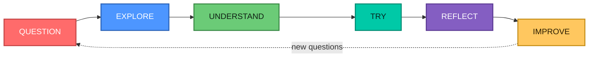
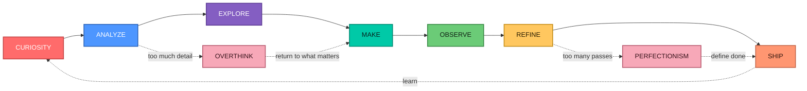

<table width="100%">
<tr>
<td width="34%" align="center" valign="top">


<br />
<b>dr. Novia Dwi Anggraini</b><br />
Physician · Independent Explorer
<br /><br />

<a href="https://github.com/noviaanggraini0511">
  
</a>

<br />


<br />


</td>

<td width="66%" valign="top">

### `NOVIA STUDIO / PERSONAL SIGNAL`

<a href="https://github.com/noviaanggraini0511">
  
</a>

<b>Current signal:</b> curiosity · structure · experimentation · refinement

I am naturally drawn to questions that invite a deeper look. I like understanding how something works, what makes it better, and whether there is a clearer or more useful way to approach it.

I care about quality, but I also care about usefulness. A beautiful idea that cannot be applied is still unfinished.

<p>
  <a href="https://github.com/noviaanggraini0511" title="GitHub">
    
  </a>
</p>

<sub><code>CURIOSITY → UNDERSTANDING → EXPLORATION → DECISION → REFINEMENT</code></sub>

</td>
</tr>
</table>

---

### `01 / CORE PERSONALITY`

I am curious, ambitious, analytical, and strongly detail-oriented. I tend to look beyond the obvious answer and keep exploring until I understand the structure underneath it.

At the same time, I am practical. I prefer ideas that can become something concrete — a decision, an improvement, a working solution, or simply a clearer way of seeing the problem.

I enjoy discovering new fields, experimenting with unfamiliar tools, and learning through direct contact with the subject rather than staying at the surface. High standards are part of how I work, but they also mean I rarely feel that something is completely finished.

<p align="center">
  
  
  
  
  
  
</p>

---

### `02 / SELECTED PORTFOLIO`

The work below is currently represented in my portfolio build. I am interested in projects where **clarity, visual judgment, practical thinking, and experimentation** meet.

<table width="100%">
<tr>
<td width="50%" valign="top">

#### `01 · FORMA`

**Brand / Digital · 2026**

A quieter identity for a design-led workspace.


</td>
<td width="50%" valign="top">

#### `02 · NOMA`

**Web / Strategy · 2025**

Turning a complex service into a simple path forward.


</td>
</tr>

<tr>
<td width="50%" valign="top">

#### `03 · ARC`

**Product / UI · 2025**

A focused product system for teams moving fast.


</td>
<td width="50%" valign="top">

#### `04 · FIELD NOTES`

**Editorial / Web · 2024**

An editorial platform built around curiosity.


</td>
</tr>
</table>

<p align="center">
  <a href="https://github.com/noviaanggraini0511/novsite">
    
  </a>
</p>

---

### `03 / STRENGTHS`

<table width="100%">
<tr>
<td width="33%" valign="top">

<b><code>DEPTH</code></b>

I rarely stop at the first explanation. I prefer to understand the logic, context, and details behind something before I consider it truly understood.

</td>
<td width="33%" valign="top">

<b><code>ADAPTABILITY</code></b>

New subjects do not intimidate me for long. I learn by exploring, asking questions, testing assumptions, and gradually building a working mental model.

</td>
<td width="33%" valign="top">

<b><code>QUALITY INSTINCT</code></b>

I notice structure, inconsistencies, presentation, and small details that affect the overall quality of a result.

</td>
</tr>
<tr>
<td width="33%" valign="top">

<b><code>INITIATIVE</code></b>

When I see something that can be improved, my instinct is usually to investigate it rather than wait for someone else to define the next step.

</td>
<td width="33%" valign="top">

<b><code>PRACTICAL REASONING</code></b>

I like thinking carefully, but I am most satisfied when reasoning leads to a clear action or a usable solution.

</td>
<td width="33%" valign="top">

<b><code>GROWTH DRIVE</code></b>

I am motivated by progress — learning something new, becoming more capable, or improving the quality of something I already know how to do.

</td>
</tr>
</table>

---

### `04 / WEAKNESSES & BLIND SPOTS`

> [!NOTE]
> High standards are useful until they begin to delay the point at which **good is already good enough**.

<table width="100%">
<tr>
<td width="50%" valign="top">

<b><code>OVERTHINKING</code></b>

I can spend too much time examining possibilities, especially when several options are all defensible. More information often feels useful — even when the decision already has enough evidence.

</td>
<td width="50%" valign="top">

<b><code>PERFECTIONISM</code></b>

I sometimes keep refining work after the important problem has already been solved. The last ten percent can quietly consume more energy than the first ninety.

</td>
</tr>
<tr>
<td width="50%" valign="top">

<b><code>DIFFICULTY CALLING IT DONE</code></b>

Because I notice details easily, I can always find one more thing that could be improved. Completion sometimes requires deliberately choosing a stopping point.

</td>
<td width="50%" valign="top">

<b><code>OPTION OVERLOAD</code></b>

Exploration is one of my strengths, but too much exploration can make simple choices feel more complex than they need to be.

</td>
</tr>
</table>

---

### `05 / WORK STYLE`

I work best when the objective is clear but the path still leaves room for judgment. I like having enough independence to investigate, organize, and improve the work rather than simply follow instructions mechanically.

My natural pattern is iterative: understand the problem, establish a structure, test an approach, notice what feels wrong, and refine it. I prefer progress I can see and solutions I can actually use.

```text
UNDERSTAND THE PROBLEM
        ↓
FIND THE STRUCTURE
        ↓
TRY SOMETHING REAL
        ↓
OBSERVE THE DETAILS
        ↓
REFINE WHAT MATTERS
        ↓
SHIP — BEFORE PERFECTION BECOMES DELAY
```

---

### `06 / LEARNING STYLE`

I learn through exploration more than memorization. A subject becomes interesting when I can connect theory to something concrete, test it, compare alternatives, and understand why one approach works better than another.

I tend to move from broad curiosity into increasingly specific questions. Once something catches my attention, I can go surprisingly deep into the details.

<details open>
<summary><b><code>LEARNING LOOP // FROM CURIOSITY TO MASTERY</code></b></summary>



</details>

---

### `07 / COMMUNICATION STYLE`

I prefer communication that is clear, thoughtful, and direct without being unnecessarily blunt. I appreciate enough context to understand the reasoning, but I do not enjoy complexity for its own sake.

I tend to ask follow-up questions when something feels incomplete or imprecise. This is usually not disagreement — it is how I build confidence that I actually understand the issue.

<table width="100%">
<tr>
<td width="50%" valign="top">

<b><code>I VALUE</code></b>

- clear reasoning;
- useful context;
- honest feedback;
- concrete examples;
- well-structured information;
- room to ask **why?**

</td>
<td width="50%" valign="top">

<b><code>I AVOID</code></b>

- vague conclusions;
- unnecessary jargon;
- style without substance;
- rushed assumptions;
- answers that sound certain without explaining why.

</td>
</tr>
</table>

---

### `08 / DECISION-MAKING STYLE`

I usually make decisions by combining analysis with practical judgment. I like comparing the important variables, understanding trade-offs, and checking whether an option still makes sense in the real world.

My risk is not impulsiveness. It is staying in analysis mode longer than necessary because I want confidence that I have not missed a better option.

<p align="center">
  
</p>

---

### `09 / WHAT MOTIVATES ME`

<table width="100%">
<tr>
<td width="25%" valign="top">

<b><code>DISCOVERY</code></b><br />
<small>Finding something I did not understand before.</small>

</td>
<td width="25%" valign="top">

<b><code>PROGRESS</code></b><br />
<small>Seeing measurable improvement in skill, quality, or understanding.</small>

</td>
<td width="25%" valign="top">

<b><code>AUTONOMY</code></b><br />
<small>Having enough ownership to think, explore, and make meaningful choices.</small>

</td>
<td width="25%" valign="top">

<b><code>CRAFT</code></b><br />
<small>Turning something ordinary into something considered, clear, and well made.</small>

</td>
</tr>
</table>

---

### `10 / WHAT CHALLENGES ME`

I find it difficult to stay engaged with work that feels careless, unnecessarily repetitive, or resistant to improvement. Ambiguous expectations can also be frustrating when there is no clear way to judge whether the result is actually good.

The more I care about an outcome, the easier it is for me to over-invest in the details. One of my ongoing challenges is knowing when deeper exploration will improve the result — and when it is simply delaying the decision.

> [!IMPORTANT]
> The goal is not to lower the standard. It is to become better at knowing **which details deserve the standard**.

---

### `11 / PERSONAL OPERATING SYSTEM`

A simplified map of how I tend to move from curiosity to action:



<sub><code>THE STANDARD STAYS HIGH · THE LOOP GETS SMARTER</code></sub>

---

### `12 / MAC TERMINAL`

<table width="100%">
<tr>
<td>

**🔴 &nbsp; 🟡 &nbsp; 🟢 &nbsp;&nbsp; `novia@macbook — zsh`**

</td>
</tr>
<tr>
<td>


```javascript
const novia = {
  curious: true,
  ambitious: true,
  analytical: true,
  adaptable: true,
  standards: "high",
  mode: "learn → test → refine"
};

while (novia.isCurious) {
  const insight = explore();
  const useful = makePractical(insight);

  if (useful.isClear && useful.isReady) {
    ship(useful);
    break;
  }

  refine(useful);
}
```

`novia@macbook ~ %` <sub>still learning, still refining.</sub>

</td>
</tr>
</table>

---

### `13 / ONE SENTENCE`

> **A curious, high-standard explorer who likes to understand things deeply, turn complexity into something practical, and keep refining the result — sometimes longer than necessary.**

---

### `14 / PERSONAL OPERATING PRINCIPLES`

```text
Stay curious.
Understand before judging.
Explore before assuming.
Prefer clarity over complexity.
Make the idea useful.
Notice the details — but know which ones matter.
Keep improving.
Know when to stop.
```

---

### `15 / CURRENT SIGNAL`

<table width="100%">
<tr>
<td width="50%" valign="top">

<b><code>HOW I TEND TO THINK</code></b>

Curiosity first. Analysis second. Application before abstraction. Refinement after evidence.

</td>
<td width="50%" valign="top">

<b><code>WHAT I AM PRACTICING</code></b>

Keeping the standards high while becoming more comfortable with iteration, imperfect first versions, and decisions made with enough — rather than infinite — information.

</td>
</tr>
</table>

---

<p align="center">
  <b>Curiosity with standards. Exploration with structure.</b><br />
  <sub>Still learning. Still refining. Still asking better questions.</sub><br /><br />
  <a href="https://github.com/noviaanggraini0511">
    
  </a>
  &nbsp;
  <a href="https://github.com/noviaanggraini0511/novsite">
    
  </a>
</p>
