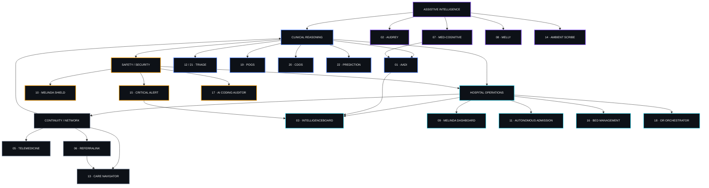
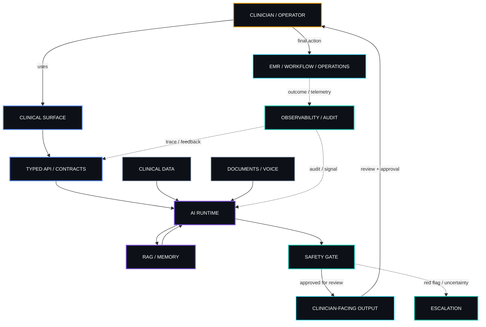
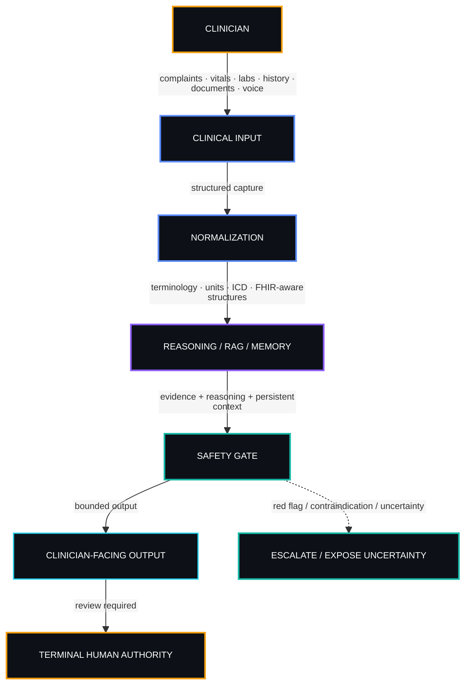
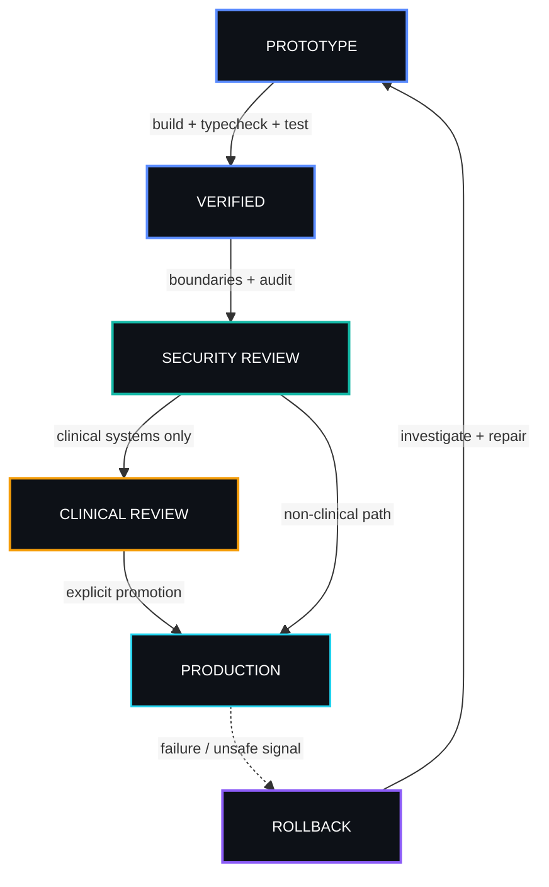
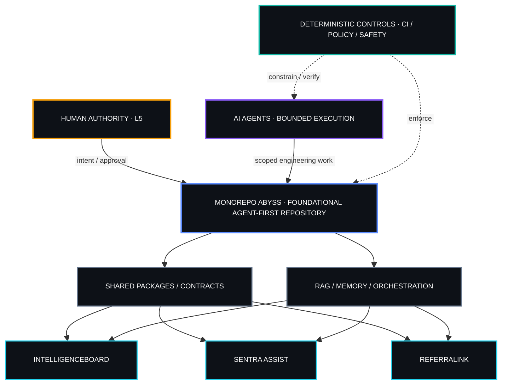
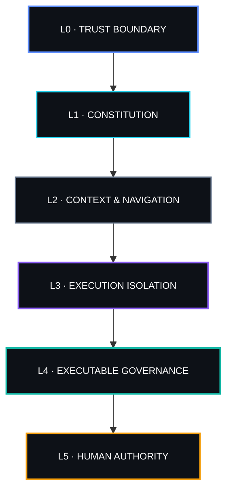
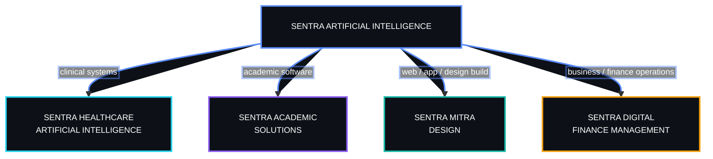

<table width="100%">
<tr>
<td width="34%" align="center" valign="top">


<br />
<b>dr. Ferdi Iskandar</b><br />
Lead Architect
<br />
<a href="https://ferdiiskandar.com">
  
</a>
<br />


</td>
<td width="66%" valign="top">

### [`SENTRA / THE ORIGIN`](https://sentrahai.com/)

<a href="https://ferdiiskandar.com">
  
</a>

<b>Operational signal:</b> Kediri, Indonesia · UTC+7 · clinical intelligence under active construction

<a href="https://sentrahai.com/"><b>Sentra Artificial Intelligence</b></a><br />
Twenty-two systems. One foundation. One governing boundary: <b>human authority</b>.

<p>
  <a href="https://github.com/drferdii" title="GitHub"></a>&nbsp;&nbsp;
  <a href="https://ferdiiskandar.com" title="ferdiiskandar.com"></a>&nbsp;&nbsp;
        <a href="https://sentrahai.com/" title="Sentra Artificial Intelligence"></a>&nbsp;&nbsp;
      <a href="https://medium.com/@drferdiiskandar" title="Medium"></a>&nbsp;&nbsp;
  <a href="https://orcid.org/0009-0003-3788-1307" title="ORCID"></a>&nbsp;&nbsp;
  <a href="https://x.com/ClaudesyI81047" title="X"></a>&nbsp;&nbsp;
  <a href="https://substack.com/@drferdiiskandar" title="Substack"></a>&nbsp;&nbsp;
  <a href="https://www.kaggle.com/drferdiiskandar" title="Kaggle"></a>&nbsp;&nbsp;
  <a href="https://www.reddit.com/user/SixCupaCoffee" title="Reddit"></a>&nbsp;&nbsp;
  <a href="https://www.linkedin.com/in/dr-ferdi-iskandar-1b620a3b5"></a>&nbsp;&nbsp;
  <a href="https://huggingface.co/dr-Ferdi" title="Hugging Face"></a>&nbsp;&nbsp;
  <a href="https://www.instagram.com/drferdiiskandar" title="Instagram"></a>
</p>

<sub><code>CLINICAL SIGNAL → REASONING → VERIFICATION → HUMAN AUTHORITY → ACTION</code></sub>

</td>
</tr>
</table>

---

### `01 / ORIGIN SIGNAL`

**[Sentra](https://sentrahai.com/)** is built to make complex workflows feel simpler, faster, and more approachable. The project focuses on giving developers a clean, practical foundation they can understand, extend, and integrate without unnecessary overhead.

Rather than treating clinical measurements as isolated snapshots, [Sentra](https://sentrahai.com/) is built around the idea of clinical trajectory—understanding how a patient is changing over time, identifying meaningful signs of deterioration, and helping surface risk before it becomes a critical event. The goal is simple but important: support earlier intervention and help stop preventable patient deterioration.

This repository contains the work behind [Sentra](https://sentrahai.com/) as that idea is developed, tested, and refined into a practical clinical system.

Whether you're exploring [Sentra](https://sentrahai.com/) for the first time, contributing to the project, or using it as part of your own stack, the goal is straightforward: provide a reliable, developer-friendly experience while keeping the codebase open, maintainable, and easy to build on.

This repository contains the source code, documentation, and everything you need to get started with [Sentra](https://sentrahai.com/). Contributions, ideas, and feedback are always welcome.

-- https://ferdiiskandar.com

<p align="center">
  
  
  
</p>

<table>
<tr>
<td width="33%" valign="top">

<b><code>LAYER I · JUDGMENT</code></b>

Differential reasoning, triage logic, guideline-aware workflows, and the safety gates that keep machine output subordinate to human decision.


</td>
<td width="33%" valign="top">

<b><code>LAYER II · SUBSTRATE</code></b>

RAG, persistent memory, orchestration, voice agents, autonomous workflows, observability. The machinery beneath the interface.


</td>
<td width="33%" valign="top">

<b><code>LAYER III · GROUND TRUTH</code></b>

Hospital dashboards, EMR bridges, coding audit, admission flow, bed management, telemedicine. Where theory meets a 2 AM emergency ward.


</td>
</tr>
</table>

The objective is precise: **convert fragmented healthcare workflows into intelligent, auditable systems that a clinician would stake their license on.**

---

### `02 / DOCTRINE`

> [!IMPORTANT]
> **AI in medicine should not perform. It should hold.** Useful, humble, explainable, safe — or it doesn't ship.

<table>
<tr>
<td width="50%" valign="top">

<b><code>THE HUMAN HOLDS THE KEY</code></b>

Every system here terminates at a human reviewer. The machine proposes, structures, retrieves. It never signs. Final authority is not a feature — it's a boundary.

</td>
<td width="50%" valign="top">

<b><code>GATED REASONING</code></b>

No clinical output crosses the boundary without passing deterministic checks: red-flag detection, contraindication review, uncertainty handling, escalation triggers.

</td>
</tr>
<tr>
<td width="50%" valign="top">

<b><code>BUILT FOR THIS TERRAIN</code></b>

Indonesian healthcare has its own physics: BPJS complexity, EMR friction, broken referral pathways, fragmented patient journeys. Systems here are shaped by that terrain, not imported over it.

</td>
<td width="50%" valign="top">

<b><code>SEPARABLE BY DESIGN</code></b>

Diagnosis, retrieval, memory, EMR automation, telemedicine, security — each module can be inspected, audited, and replaced without the others noticing. Independent now, unified later.

</td>
</tr>
<tr>
<td width="50%" valign="top">

<b><code>ONE PROBLEM, THEN DEPTH</code></b>

No fantasy platforms. Each system started as one specific pain, observed firsthand, solved narrowly. Expansion happens after proof, never before.

</td>
<td width="50%" valign="top">

<b><code>NO MAGIC WITHOUT AUDIT</code></b>

If a system can't show its inputs, its reasoning boundaries, its confidence, and its escalation logic — it doesn't belong near a patient.

</td>
</tr>
</table>

---

### `03 / SYSTEM CONSTELLATION`

<p align="center">
  
  
  
  
  
</p>

<p align="center">
  
</p>

<details open>
<summary><b><code>LIVE TOPOLOGY // SYSTEM RELATION MAP</code></b></summary>



</details>

<table>
<tr>
<td width="50%" valign="top">

<b><code>01 · AADI</code></b>
<b>Autonomous Artificial Diagnostic Intelligence</b>

A layered diagnostic reasoning engine: structured differentials, safety checks, ICD mapping, hard clinician-review boundaries.

<br />
<sub>diagnostic support. Never final diagnosis.</sub>

</td>
<td width="50%" valign="top">

<b><code>02 · AUDREY</code></b>
<b>Voice-First Clinical Intelligence</b>

A real-time voice presence in the consultation room. Captures clinical context, surfaces structured insight, dissolves documentation friction.

<br />
<sub>ambient assistance. Listens so the doctor can look at the patient.</sub>

</td>
</tr>
<tr>
<td width="50%" valign="top">

<b><code>03 · INTELLIGENCE DASHBOARD</code></b>
<b>Unified Clinical Operations Platform</b>

One command surface for EMR workflows, ICD support, reporting, patient monitoring, telemedicine, and clinical intelligence.

<br />
<sub>single pane over the entire operation.</sub>

</td>
<td width="50%" valign="top">

<b><code>04 · ASISTE MEDIS (SENTRA ASSIST)</code></b>
<b>Clinical Workflow Automation Extension</b>

A browser extension embedded inside the clinician's existing workflow: structured data transfer into EMR, decision-support surfaces where the work actually happens.

<br />
<sub>erase repetitive EMR friction.</sub>

</td>
</tr>
<tr>
<td width="50%" valign="top">

<b><code>05 · TELEMEDICINE</code></b>
<b>Remote Consultation Infrastructure</b>

WebRTC consultation with clinical notes, scheduling, patient-room flow, and continuity — distance care that behaves like care, not like a video call.

<br />
<sub>clinical-grade remote consultation.</sub>

</td>
<td width="50%" valign="top">

<b><code>06 · REFERRALINK</code></b>
<b>Referral & Awareness-Intelligence Protocol</b>

Referral routing and claim awareness engineered around regulatory fluctuation, BPJS complexity, semantic cache, contextual decision assistance.

<br />
<sub>scaffold live. Awaiting final verification, refactor decision, and security audit before promotion.</sub>

</td>
</tr>
<tr>
<td width="50%" valign="top">

<b><code>07 · MED-COGNITIVE</code></b>
<b>Persistent Clinical Memory Layer</b>

Memory architecture for agents: semantic retrieval, persistent context, structured recall across sessions.

<br />
<sub>context-aware agents with zero hidden assumptions.</sub>

</td>
<td width="50%" valign="top">

<b><code>08 · MELLY</code></b>
<b>Maternal & Pediatric Personal Virtual Agent</b>

A personal agent that walks with the patient — pre-conception, pregnancy, postpartum, pediatric continuity.

<br />
<sub>proactive companionship across the maternal-child journey.</sub>

</td>
</tr>
<tr>
<td width="50%" valign="top">

<b><code>09 · MELINDA DASHBOARD</code></b>
<b>Hospital Interoperability Dashboard</b>

Cross-unit interoperability for RSIA Melinda: fragmented departmental data made visible on one operational surface.

<br />
<sub>collapse the silos.</sub>

</td>
<td width="50%" valign="top">

<b><code>10 · MELINDA SHIELD</code></b>
<b>Predictive Cybersecurity Architecture</b>

Layered defense over clinical data: monitoring, encryption, behavioral analysis, access governance, rapid containment.

<br />
<sub>harden the perimeter of the clinical AI environment.</sub>

</td>
</tr>
<tr>
<td width="50%" valign="top">

<b><code>11 · AUTONOMOUS ADMISSION</code></b>
<b>Admission & Patient Journey Automation</b>

Referral extraction, schedule validation, journey tracking. The queue becomes a flow.

<br />
<sub>admission without the waiting-room entropy.</sub>

</td>
<td width="50%" valign="top">

<b><code>12 · SMART TRIAGE</code></b>
<b>Structured Early Risk Detection</b>

Structured symptom capture and emergency flagging before the face-to-face — the clinician arrives already briefed.

<br />
<sub>detect risk before it announces itself.</sub>

</td>
</tr>
<tr>
<td width="50%" valign="top">

<b><code>13 · PROACTIVE CARE NAVIGATOR</code></b>
<b>Post-Discharge Continuity Engine</b>

Post-discharge monitoring, complication prevention, immunization reminders, continuity workflows.

<br />
<sub>no patient vanishes after discharge.</sub>

</td>
<td width="50%" valign="top">

<b><code>14 · AMBIENT SCRIBE</code></b>
<b>Voice-to-EMR Documentation Engine</b>

Consultation speech into structured medical notes, mapped straight into EMR fields.

<br />
<sub>doctors watch patients, not cursors.</sub>

</td>
</tr>
<tr>
<td width="50%" valign="top">

<b><code>15 · CRITICAL ALERT SYSTEM</code></b>
<b>Early Warning & Escalation Layer</b>

Constant watch over labs, telemetry, and high-risk signals — with a direct line to the right team.

<br />
<sub>deterioration never goes unnoticed.</sub>

</td>
<td width="50%" valign="top">

<b><code>16 · PREDICTIVE BED MANAGEMENT</code></b>
<b>Discharge & Bed Readiness Orchestration</b>

Discharge readiness, bed turnover, housekeeping, pharmacy, billing — one orchestration layer over patient flow.

<br />
<sub>beds move at the speed of the hospital, not the paperwork.</sub>

</td>
</tr>
<tr>
<td width="50%" valign="top">

<b><code>17 · AI CODING AUDITOR</code></b>
<b>Clinical Coding & Claim Defense</b>

Automated audit of coding consistency against documentation. Claims defended by cleaner clinical evidence.

<br />
<sub>reduce dispute risk at the source.</sub>

</td>
<td width="50%" valign="top">

<b><code>18 · OR ORCHESTRATOR</code></b>
<b>Operating Room Logistics Intelligence</b>

Real-time coordination of priority cases, team readiness, blood product logistics, room allocation.

<br />
<sub>high-stakes logistics, zero improvisation.</sub>

</td>
</tr>
<tr>
<td width="50%" valign="top">

<b><code>19 · POGS</code></b>
<b>Pregnancy Observation & Guidance System</b>

Maternal-fetal monitoring, risk detection, structured antenatal context, escalation support.

<br />
<sub>safer surveillance for two lives at once.</sub>

</td>
<td width="50%" valign="top">

<b><code>20 · CDOS</code></b>
<b>Clinical Decision Orchestration System</b>

Guidelines translated into living diagnostic and operational workflows — clinician oversight preserved end to end.

<br />
<sub>guidelines that execute, not gather dust.</sub>

</td>
</tr>
<tr>
<td width="50%" valign="top">

<b><code>21 · TRIAGE</code></b>
<b>Algorithmic Emergency Prioritization</b>

Severity-score prioritization, risk stratification, structured routing.

<br />
<sub>priority by risk, not by noise.</sub>

</td>
<td width="50%" valign="top">

<b><code>22 · PREDICTION</code></b>
<b>Clinical Risk Forecasting Engine</b>

Deterioration, complications, readmission risk, trajectory shifts — estimated before they arrive.

<br />
<sub>care that moves from reactive to anticipatory.</sub>

</td>
</tr>
</table>

---

### `04 / THE ENGINE ROOM`

<table>
<tr>
<td width="33%" valign="top">

<b><code>REASONING</code></b>

- Differential diagnosis support
- Deterministic safety gates
- ICD & guideline mapping
- Red-flag escalation
- Confidence & uncertainty handling

</td>
<td width="33%" valign="top">

<b><code>RETRIEVAL & MEMORY</code></b>

- Medical RAG
- Document ingestion
- Semantic search
- Persistent agent memory
- Local-first knowledge workflows

</td>
<td width="33%" valign="top">

<b><code>OPERATIONS</code></b>

- EMR automation
- Voice-to-EMR
- Telemedicine flow
- Dashboard intelligence
- Hospital workflow orchestration

</td>
</tr>
</table>

<details open>
<summary><b><code>RUNTIME TOPOLOGY // CONTROL & DATA PLANE</code></b></summary>



</details>

<p align="center">
  
</p>

---

### `05 / SIGNAL PATH`



The architecture is deliberately conservative. **The machine proposes, structures, retrieves, assists. The clinician decides. Always.**

---

### `06 / BUILD PROTOCOL`

<table>
<tr>
<td width="50%" valign="top">

<b><code>FRONTEND</code></b>

React, Next.js, Tailwind. Calm enterprise surfaces, strict hierarchy, readable data — interfaces that stay quiet under pressure.

</td>
<td width="50%" valign="top">

<b><code>BACKEND</code></b>

TypeScript-first services, modular APIs, auditable contracts, clean package boundaries, explicit integration layers.

</td>
</tr>
<tr>
<td width="50%" valign="top">

<b><code>AI RUNTIME</code></b>

RAG, orchestration, agent memory. Local-first where possible, model-agnostic by design, safety-aware at the output boundary.

</td>
<td width="50%" valign="top">

<b><code>VOICE & DOCUMENTS</code></b>

Real-time clinical voice capture, voice-to-EMR, OCR ingestion, structured note generation. Automation is review-first — nothing writes itself into the record unseen.

</td>
</tr>
<tr>
<td width="50%" valign="top">

<b><code>DATA & SECURITY</code></b>

Structured contracts, retrieval-ready documents, PHI/PII boundaries, least privilege, full audit trail. No unsafe logging. Ever.

</td>
<td width="50%" valign="top">

<b><code>DEPLOYMENT</code></b>

Hard wall between prototype and production. Verification before promotion, rollback before courage, operational realism over demos.

</td>
</tr>
</table>

<details open>
<summary><b><code>PROMOTION STATE // PROTOTYPE → PRODUCTION</code></b></summary>



</details>

---

### `07 / THE SENTRA OPERATING STANDARD`

```text
No magic without audit.
No diagnosis without clinician review.
No automation without rollback.
No clinical data without security boundaries.
No expansion without one solved problem first.
```

> [!CAUTION]
> **Human authority is a terminal boundary.** Any clinical path that cannot expose its inputs, uncertainty, failure mode, and escalation route is not promotion-ready.

Every system answers five questions before it earns a repository:

<table>
<tr>
<th align="left">Interrogation</th>
<th align="left">Required answer</th>
</tr>
<tr>
<td><b>What clinical problem does this solve?</b></td>
<td>A specific workflow pain. Not an ambition.</td>
</tr>
<tr>
<td><b>Who is the human reviewer?</b></td>
<td>Named role: doctor, nurse, admin, verifier, operator.</td>
</tr>
<tr>
<td><b>What is outside the scope?</b></td>
<td>Non-scope is the fence against unsafe expansion.</td>
</tr>
<tr>
<td><b>What can fail?</b></td>
<td>Failure modes documented before deployment, not after.</td>
</tr>
<tr>
<td><b>How is it verified?</b></td>
<td>Build, typecheck, test, audit — clinical review where lives are involved.</td>
</tr>
</table>

---

### `08 / MONOREPO ABYSS · AGENT-FIRST FOUNDATION`

**Monorepo Abyss is the foundational engineering substrate of [Sentra Artificial Intelligence](https://sentrahai.com/)** — the canonical environment that unifies shared packages, clinical applications, typed contracts, RAG and memory systems, orchestration, governance, safety controls, and infrastructure.

**An Agent-First Repository is the operating model applied to that foundation:** a human-governed software environment designed so AI agents can execute engineering work efficiently while deterministic controls constrain their authority, verify their output, and preserve human accountability.

SAFRS — the **[Sentra](https://sentrahai.com/) Agent-First Repository Standard** — formalizes how Monorepo Abyss operates under that model: **Human-Governed · Agent-Executed · Machine-Enforced**.

<a href="https://github.com/drferdii/Monorepo-safrs"><b>↗ SAFRS reference implementation · drferdii/Monorepo-safrs</b></a>

<p align="center">
  
  
  
  
  
  
</p>

<details open>
<summary><b><code>MONOREPO ABYSS TOPOLOGY // AUTHORITY ↔ EXECUTION ↔ CONTROL</code></b></summary>



</details>

<details>
<summary><b><code>SAFRS CONTROL STACK // SIX LAYERS</code></b></summary>



<sub><code>CONSTRAINT DESCENDS · AUTHORITY ASCENDS · CAPABILITY ≠ TRUST</code></sub>

</details>

<table>
<tr>
<td width="50%" valign="top">

<b><code>MONOREPO ABYSS // FOUNDATIONAL AGENT-FIRST REPOSITORY</code></b>

The foundational engineering environment for [Sentra Artificial Intelligence](https://sentrahai.com/). Monorepo Abyss is the shared substrate from which [Sentra](https://sentrahai.com/) systems are built: packages, healthcare applications, typed contracts, RAG and memory, orchestration, governance, safety controls, and clinical infrastructure — operated as an Agent-First Repository under deterministic verification and non-delegable human authority.

<a href="https://github.com/drferdii/Monorepo-safrs"><sub><b>SAFRS reference implementation ↗</b></sub></a>

</td>
<td width="50%" valign="top">

<b><code>INTELLIGENCEBOARD</code></b>

Clinical dashboard and operational command surface: CDSS, telemedicine, EMR bridge workflows, trajectory analytics, reporting.

</td>
</tr>
<tr>
<td width="50%" valign="top">

<b><code>SENTRA ASSIST</code></b>

Clinical browser-assistance surface — emergency detection, diagnosis support, structured workflow automation, side-panel intelligence.

</td>
<td width="50%" valign="top">

<b><code>REFERRALINK</code></b>

Referral and routing surface with diagnosis endpoint concepts, semantic cache, memory-service helpers.

</td>
</tr>
</table>

---

### `09 / SENTRA DIVISIONAL ARCHITECTURE`

**Sentra Artificial Intelligence operates across four primary divisions** — one healthcare-facing, one academic, one design-and-build, and one finance/operations-focused. Together, they form the outward operating structure built on top of the Monorepo Abyss foundation.

<p align="center">
  
  
  
  
  
</p>

<details open>
<summary><b><code>SENTRA DIVISIONAL MAP // BUSINESS SURFACES</code></b></summary>



</details>

<table width="100%">
<tr>
<td width="50%" valign="top">


<b><code><a href="https://sentrahai.com/">SENTRA HEALTHCARE ARTIFICIAL INTELLIGENCE</a></code></b><br />
<sub>The clinical and health-systems division. Focused on software, intelligence surfaces, and workflow tools for care delivery — including CDSS, diagnostic support, telemedicine, EMR-adjacent tooling, hospital operations, and patient-journey orchestration.</sub>

</td>
<td width="50%" valign="top">


<b><code><a href="https://sentrahai.com/">SENTRA ACADEMIC SOLUTIONS</a></code></b><br />
<sub>The academic software division. Focused on building digital products for academic workflows — such as research tooling, publication systems, knowledge-management tools, education platforms, and institutional academic support software.</sub>

</td>
</tr>
<tr>
<td width="50%" valign="top">


<b><code><a href="https://sentrahai.com/">SENTRA MITRA DESIGN</a></code></b><br />
<sub>The design-and-build division. Focused on website design, application interface design, product presentation, and digital experience development for partners, clients, and ecosystem projects.</sub>

</td>
<td width="50%" valign="top">


<b><code><a href="https://sentrahai.com/">SENTRA DIGITAL FINANCE MANAGEMENT</a></code></b><br />
<sub>The finance and operational systems division. Focused on digital finance management, internal business operations, financial visibility, reporting, and future tooling for budgeting, administration, and management workflows.</sub>

</td>
</tr>
</table>

---

### `10 / OFFICIAL SPONSOR`

<table width="100%">
<tr>
<td width="33%" align="center" valign="top">
  <br /><br />
  
  <br />
  <b>RSIA Melinda DHAI</b><br />
  <sub>Strategic healthcare collaboration and institutional support for applied clinical intelligence, operational interoperability, and bedside-first AI workflows.</sub>
</td>
<td width="33%" align="center" valign="top">
  <br /><br />
  
  <br />
  <b>MedLab</b><br />
  <sub>Supporting ecosystem for medical and diagnostic innovation, aligned with workflow modernization, health data intelligence, and practical AI deployment.</sub>
</td>
<td width="33%" align="center" valign="top">
  <br /><br />
  
  <br />
  <b>Q Sehat Group</b><br />
  <sub>A pharmaceutical group supporting the healthcare ecosystem through medicine supply continuity, distribution infrastructure, and practical collaboration in clinical intelligence deployment.</sub>
</td>
</tr>
</table>

---

### `11 / OPEN CHANNEL`

<p align="center">
  <a href="https://discord.gg/1511829076313374745"></a>
  <a href="https://linkedin.com/in/dr-ferdi-iskandar-1b620a3b5"></a>
  <a href="https://medium.com/@ferdiiskandarse"></a>
  <a href="https://quora.com/profile/drferdiiskadar@gmail.com"></a>
  <a href="https://reddit.com/user/SixCupaCoffee"></a>
  <a href="https://tiktok.com/@drferdii"></a>
  <a href="https://x.com/ClaudesyI81047"></a>
  <a href="mailto:drferdiiskadar@gmail.com"></a>
</p>

---

### `12 / ACTIVE STACK`

<table width="100%">
<tr>
<td width="50%" valign="top">
  <a href="https://cursor.com/"></a><br />
  
  <br />
  <b>Cursor</b><br />
  <small>AI-first code editor for repo-aware editing, fast iteration, and day-to-day agentic development workflows.</small><br />
  <small><a href="https://cursor.com/">cursor.com ↗</a></small>
</td>
<td width="50%" valign="top">
  <a href="https://www.antigravity.google/"></a><br />
  
  <br />
  <b>Google Antigravity</b><br />
  <small>Agent-first development platform for orchestrating multiple agents, artifacts, and verification flows across IDE, CLI, and SDK surfaces.</small><br />
  <small><a href="https://www.antigravity.google/">antigravity.google ↗</a></small>
</td>
</tr>
<tr>
<td width="50%" valign="top">
  <a href="https://claude.com/product/claude-code"></a><br />
  
  <br />
  <b>Anthropic · Claude Code</b><br />
  <small>Terminal- and IDE-native coding agent for deep reasoning, codebase analysis, implementation, and verification-heavy engineering tasks.</small><br />
  <small><a href="https://claude.com/product/claude-code">claude.com/product/claude-code ↗</a></small>
</td>
<td width="50%" valign="top">
  <a href="https://openai.com/codex/"></a><br />
  
  <br />
  <b>OpenAI · Codex</b><br />
  <small>Software-engineering agent for structured task execution, refactors, reviews, and background coding work across projects.</small><br />
  <small><a href="https://openai.com/codex/">openai.com/codex ↗</a></small>
</td>
</tr>
<tr>
<td width="50%" valign="top">
  <a href="https://openrouter.ai/"></a><br />
  
  <br />
  <b>OpenRouter</b><br />
  <small>Unified routing layer providing one consistent API surface across multiple frontier and open-model providers.</small><br />
  <small><a href="https://openrouter.ai/">openrouter.ai ↗</a></small>
</td>
<td width="50%" valign="top">
  <a href="https://ai.google.dev/"></a><br />
  
  <br />
  <b>Google AI Environment</b><br />
  <small>Gemini and Google AI developer environment for model access, experimentation, and broader agentic tooling.</small><br />
  <small><a href="https://ai.google.dev/">ai.google.dev ↗</a></small>
</td>
</tr>
<tr>
<td width="50%" valign="top">
  <a href="https://www.codewithbullet.com/"></a><br />
  
  <br />
  <b>Bullet Coding</b><br />
  <small>Constraint-driven coding discipline centered on concise execution loops, bounded scope, explicit prompts, and fast ship-first iteration.</small><br />
  <small><a href="https://www.codewithbullet.com/">codewithbullet.com ↗</a></small>
</td>
<td width="50%" valign="top">
  <a href="https://grok.com/"></a><br />
  
  <br />
  <b>Grok</b><br />
  <small>Additional frontier reasoning layer for fast ideation, synthesis, and alternate model perspective.</small><br />
  <small><a href="https://grok.com/">grok.com ↗</a></small>
</td>
</tr>
<tr>
<td width="50%" valign="top">
  <a href="https://www.spaceai.so/"></a><br />
  
  <br />
  <b>Space AI</b><br />
  <small>AI-native platform used as an auxiliary experimentation surface for automated content, workflow support, and adjacent operational exploration.</small><br />
  <small><a href="https://www.spaceai.so/">spaceai.so ↗</a></small>
</td>
<td width="50%" valign="top">
  <br />
  
  
  
  <br />
  <b><code>STACK POSTURE</code></b><br />
  <small>Model-agnostic where useful, agent-first by design, audit-first in operation, and always governed by terminal human authority.</small>
</td>
</tr>
</table>

---

### `13 / INSTRUMENTATION`

<small><code>ACTUAL TECHNOLOGY SURFACE · 10 ENGINEERING PILLARS · MONOREPO ABYSS</code></small>

<table width="100%">
<tr>
<td width="50%" valign="top">


<b><code>LANGUAGES & RUNTIMES</code></b><br />
<small>TypeScript 5.9 · Python 3.12+ · Node.js 22+ · PowerShell (pwsh) · SQL · Bash · HTML5 / CSS3</small>

</td>
<td width="50%" valign="top">


<b><code>FRONTEND & UI ENGINE</code></b><br />
<small>Next.js (App Router) · React 18/19 · Vue 3 · Vite · Tailwind CSS · Framer Motion · Three.js (SentraVerse) · Radix UI · Sentra Design Tokens (OKLCH) · Sentra UI · Lucide · Recharts · ApexCharts · WXT (WebExtension) · Storybook · TanStack Query · Zustand</small>

</td>
</tr>
<tr>
<td width="50%" valign="top">


<b><code>BACKEND & API</code></b><br />
<small>FastAPI · Uvicorn / Starlette · Express.js · Flask · Frappe Framework / ERPNext · Pydantic v2 · Zod</small>

</td>
<td width="50%" valign="top">


<b><code>AI · ML · NLP · VISION</code></b><br />
<small>TensorFlow / Keras · PyTorch · Hugging Face Transformers · LangChain · LlamaIndex · OpenAI GPT-4o · Anthropic Claude · Google Gemini · Mistral AI · Tesseract.js / PyTesseract OCR · Model Context Protocol (MCP) · Assistant UI · Pandas · NumPy · BioPython · SpaCy</small>

</td>
</tr>
<tr>
<td width="50%" valign="top">


<b><code>DATABASE & STORAGE</code></b><br />
<small>PostgreSQL 16+ · Prisma ORM · MongoDB & Motor · MariaDB · SQLite / LibSQL · Redis · SQLAlchemy & Alembic · Supabase · AWS S3 / Cloudflare R2 · XLSX Engine</small>

</td>
<td width="50%" valign="top">


<b><code>DEVOPS · CLOUD · INFRA</code></b><br />
<small>Docker & Docker Compose · Kubernetes (K8s) · ArgoCD (GitOps) · Terraform (IaC) · Vercel · Cloudflare Workers / Sandbox · Nginx · Git · GitHub Actions · Dependabot</small>

</td>
</tr>
<tr>
<td width="50%" valign="top">


<b><code>MONOREPO & BUILD TOOLS</code></b><br />
<small>Turborepo 2.9 · pnpm Workspaces 9.15 · Changesets · tsx & esbuild · Rollup · SWC</small>

</td>
<td width="50%" valign="top">


<b><code>TESTING & QA</code></b><br />
<small>Vitest & Vitest UI · Playwright (E2E) · Jest · React Testing Library · Pytest · Supertest · Axe Core A11y</small>

</td>
</tr>
<tr>
<td width="50%" valign="top">


<b><code>SECURITY & GOVERNANCE</code></b><br />
<small>Husky 9 · lint-staged · ESLint 9 (Flat Config) · Prettier 3 · Stylelint 17 · CodeQL SAST · Indonesian PHI Gate Scanner · Secret Scan Gate · App Independence Validator · CRP Healthcheck</small>

</td>
<td width="50%" valign="top">


<b><code>MEDICAL & HARVESTER</code></b><br />
<small>JATS XML Parser Engine · SHA-256 Source Hasher · PDF Extraction Engine · PubMed / Europe PMC Harvester · Clinical Knowledge Registry</small>

</td>
</tr>
</table>

---

<p align="center">
  <b>Dedicated to Aldebaran, Aimee, Audrey, and Del — & the Indonesia Healthcare Ecosystem.</b><br />
  Sentra Artificial Intelligence · Built in the depth, deployed at the bedside.<br />
  <sub><code>// the surface is documentation. the depth is running.</code></sub>
</p>
